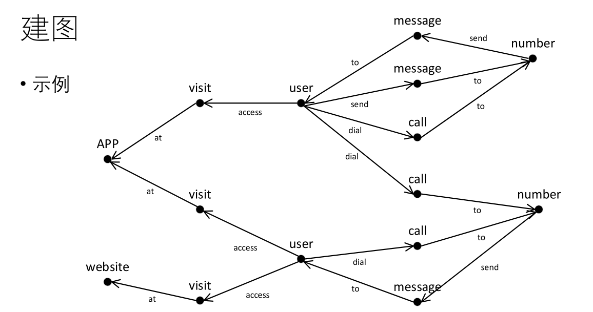

# Graph2NL
A simple program covert graph to English or Chinese

# How to Run
First download Graph2NL.jar file
Windows:  java -Dfile.encoding=utf-8 -jar Graph2NL.jar
Mac:      java -jar Graph2NL.jar





test.v

```
0 Character fake
1 Character not fake
2 User Xiaobai Li
3 User Geek Zhang
4 Number 110
5 Number 119
6 APP Meituan
7 Website baidu.com

```

test.e

```
0 2 4 called
1 2 4 called
2 4 2 message
3 2 5 called
4 3 5 called
5 5 3 message
6 2 1 is
7 3 0 is
8 2 6 visit
9 3 6 visit
10 3 7 visit
```

Result:

```
We are going to describe 4 vertices:
-----------------------------------
User: Xiaobai Li is not fake.
User: Xiaobai Li called [Number: 110; Number: 110; Number: 119; ]
User: Xiaobai Li visit [APP: Meituan; ]
-----------------------------------
User: Geek Zhang is fake.
User: Geek Zhang called [Number: 119; ]
User: Geek Zhang visit [APP: Meituan; Website: baidu.com; ]
-----------------------------------
Number: 110 message [User: Xiaobai Li; ]
-----------------------------------
Number: 119 message [User: Geek Zhang; ]
```

