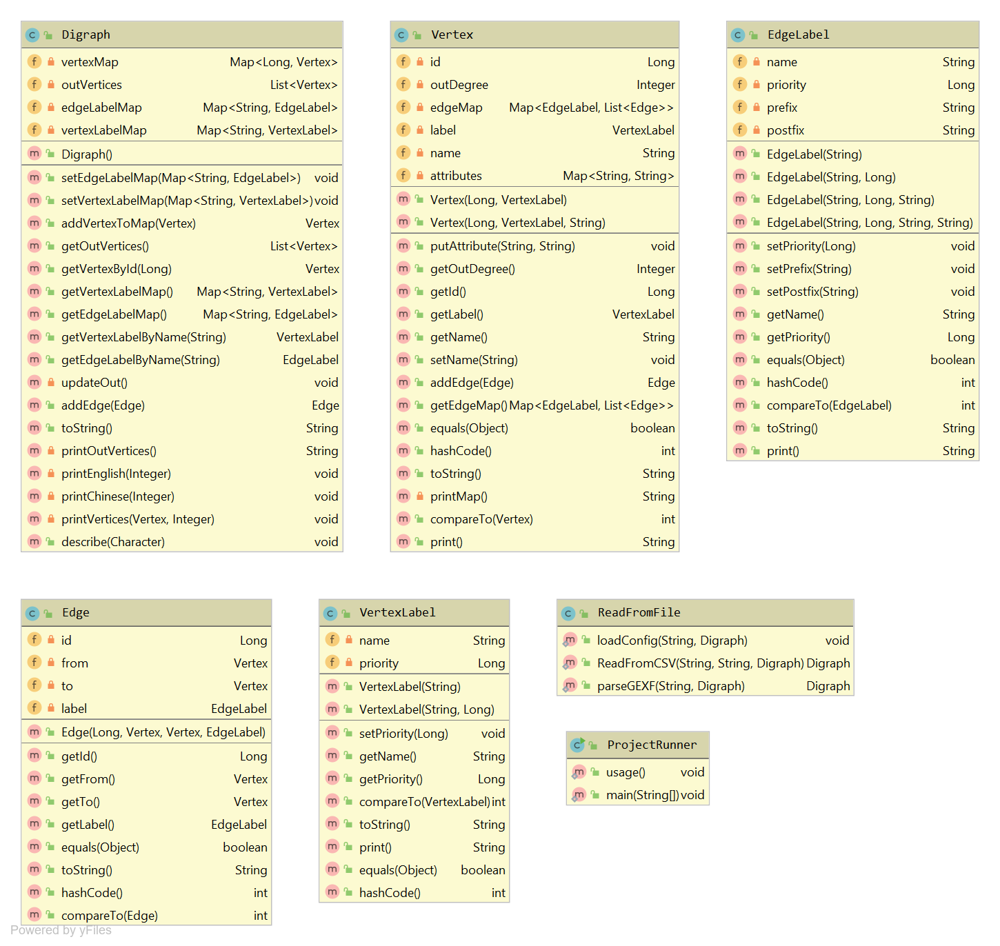

# Graph2NL

一个小程序可以将图用中文或者英文描述出来。

使用者可以通过自己配置的JSON文件来控制节点和边的描述顺序。



## 运行方法
1. 首先需要下载[Graph2NL_jar](https://github.com/LMCNN/Graph2NL/tree/master/classes/artifacts/Graph2NL_jar)这个文件夹

2. 打开终端将路径移动的Graph2NL_jar下

3. 输入以下命令：

   - Windows:  `java -Dfile.encoding=utf-8 -jar Graph2NL.jar [-h] [-e | -z]`

     ` [-v <path> | -g <fileName>]  [-c <fileName>]`

   - Mac:      `java -jar Graph2NL.jar [-h] [-e | -z] [-v <path> |`

     ` -g <fileName>]  [-c <fileName>]`

### 选择项

        -h                  打印当前帮助页
    
        -c <fileName>       使用JSON配置文件
    
        -e                  用英文描述图
    
        -z                  用中文描述图
    
        -v <directory>      用.e .v文件作为图输入文件
    
        -g <fileName>       用.gexf文件作为图输入文件


## 输入文件

#### .e .v 文件

##### .v 文件

节点输入文件。它包含三列分别为：节点的编号，节点的属性和节点的名称。每一行各个元素用逗号隔开。

样例：

```
0,Character,fake,
1,Character,not fake,
2,User,Xiaobai Li,
3,User,Geek Zhang,
4,Number,110,
5,Number,119
6,APP,WeChat
7,Website,baidu.com
```

##### .e文件

边的输入文件。它包含四列分别为：边的编号，边的起始节点的编号，边的终止节点的编号和边的标签名称。每一行各个元素用逗号隔开。

样例：

```
0,2,4,called,
1,2,4,called,
2,4,2,message,
3,2,5,called,
4,3,5,called,
5,5,3,message,
6,2,1,is,
7,3,0,is,
8,2,6,visit,
9,3,6,visit,
10,3,7,visit,
```

#### .gexf文件

此文件主要分为四个部分：头文件分，属性部分，节点部分和边部分。

头文件部分和属性目前暂不做分析主要需要配置节点和边的部分。

```xml
<?xml version="1.0" encoding="UTF-8"?>
<!-- 头文件分 -->
<gexf xmlns="http://www.gexf.net/1.2draft"xmlns:xsi="http://www.w3.org/2001/XMLSchemainstance" xsi:schemaLocation="http://www.gexf.net/1.2drafthttp://www.gexf.net/1.2draft/gexf.xsd" version="1.2">
    <meta lastmodifieddate="2019-08-12">
        <creator>Mingchi Li</creator>
        <description>Demo network</description>
    </meta>
    <graph defaultedgetype="directed">
        <!-- 属性部分 -->
        <attributes class="node">
        	<attribute id="0" title="name" type="string" />
        </attributes>
        <attributes class="edge">
        	<attribute id="0" title="name" type="string" />
        </attributes>
    	<!-- 节点部分 -->
        <nodes>
            <node id="0" label="Character">
                <attvalues>
                    <attvalue for="0" value="fake" />
                </attvalues>
            </node>
            ...
            <!-- 添加更多的节点 -->
            ...
        </nodes>
        <!-- 边部分 -->
    	<edges>
            <edge id="0" source="2" target="4">
                <attvalues>
                	<attvalue for="0" value="called" />
                </attvalues>
            </edge>
        	...
            <!-- 添加更多的边 -->
            ...
        </edges>
    </graph>
</gexf>
```

## JSON配置文件

此文件主要分为两个部分：节点标签部分和边标签部分。

#### 标签内容：

##### 节点标签属性：

- 标签的名称
- 描述节点时的优先级

##### 边标签属性：

- 标签的名称
- 描述边时的优先级
- 描述边时添加的前缀
- 描述边时添加的后缀

#### JSON配置文件样例：

```json
{
  "VertexLabel": [
    {
      "name":"User",
      "priority":2
    },
    {
      "name":"Number",
      "priority":1
    }
    //添加更多节点标签
  ],
  "EdgeLabel": [
    {
      "name":"message",
      "priority":1,
      "prefix":"send",
      "postfix":"to"
    }
    //添加更多边标签
  ]
}
```

